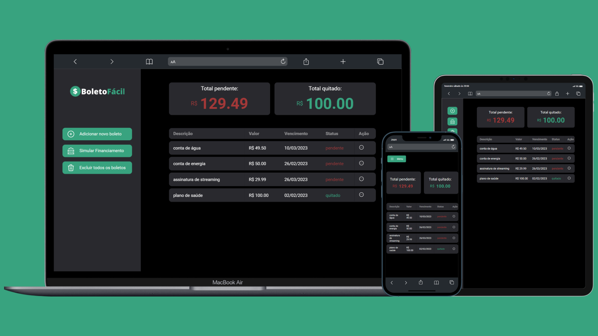

# 💰 Boleto Fácil

Aplicação web que ajuda os usuários a monitorar gastos, como boletos, faturas e contas em geral.

## 💡Funcionalides
- Adicionar boletos e organiza-los em uma tabela
- Remover os boletos selecionados
- Alterar o status do boleto (de pendente para quitado)
- Monitorar os valores de boletos que precisam ser pagos e os que já foram quitados
- Limpar todos os boletos adicionados

## 🛠️ Tecnologias utilizadas
- HTML5
- CSS3
- JavaScript
- Git e Github

## 🎨 Design
- Prototipação: [Canva](https://www.canva.com/pt_br/)
- Ideias de cores: [Andromeda da Rocketseat](https://www.youtube.com/watch?v=90y5707fJbI)
- Ícones: [Tabler Icons](https://tablericons.com/)
- Fontes: [Google Fonts](https://fonts.google.com)

## 📖 Referências
- [Maratona Discover](https://www.youtube.com/watch?v=NlDr6JX3VvA) (Rocketseat)

- [Criando uma Sidebar](https://www.youtube.com/watch?v=RlaZjCgTw9M) (Sujeito Programador)
